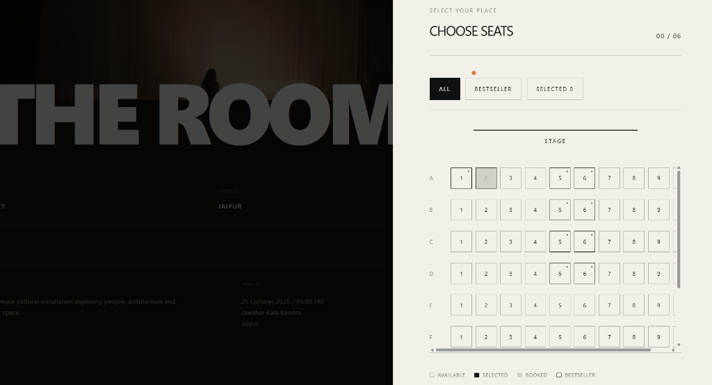

<div align="center">

# 🎟️ SeatWise

### Seat-Level Event Ticketing — Built for Concurrency

A full-stack event ticketing & seat reservation platform where **only one buyer can ever win a seat**, proven by automated concurrency tests — not by hoping.

[](https://github.com/vivekstackk/seatwise/actions/workflows/ci.yml)
[](https://nextjs.org/)
[](https://react.dev/)
[](https://www.typescriptlang.org/)
[](https://neon.tech/)
[](https://stripe.com/)
[](LICENSE)

[**Live Demo →**](https://seatwise-r2jz.onrender.com)

<br />



</div>

---

## ✨ Key Features

| Feature | Description |
|---|---|
| 🔒 **Concurrency-Safe Seat Holds** | Single data-modifying CTE guarantees exactly one buyer wins a seat — no transactions needed over Neon's HTTP driver |
| 💳 **Stripe Checkout** | Seamless payment flow with idempotent fulfilment via both webhook (push) and polling (pull) paths |
| 📱 **QR Ticket Check-In** | HMAC-signed QR codes with camera scanning at `/checkin` for event staff |
| 🔐 **Auth (Email + Google)** | Better Auth with email/password and Google OAuth, role-based access control |
| 🎭 **Role System** | `buyer` → `staff` → `organizer` → `admin` with granular permissions |
| 🚀 **8-Seat Cap Enforcement** | Per-buyer seat limit enforced at the database level under concurrent requests |
| 🛡️ **Smart Auth Gate** | Signed-out visitors see a login gate — not a cryptic error — with return-to-seat redirect |

---

## 🏗️ Tech Stack

| Layer | Technology |
|---|---|
| **Framework** | Next.js 16.3 (App Router, Turbopack) |
| **UI** | React 19, Tailwind CSS |
| **Language** | TypeScript 5 |
| **Database** | Neon Serverless Postgres (HTTP driver) |
| **ORM** | Drizzle ORM |
| **Auth** | Better Auth (Email/Password + Google OAuth) |
| **Payments** | Stripe Checkout + Webhooks |
| **Deployment** | Render |

---

## 🏛️ Architecture

```
┌─────────────────────────────────────────────────────────────┐
│                        Client (React 19)                    │
│  Seat Map UI  ─►  Auth Gate  ─►  Stripe Checkout  ─►  QR   │
└──────────────────────────┬──────────────────────────────────┘
                           │ Server Actions
┌──────────────────────────▼──────────────────────────────────┐
│                   Next.js 16 App Router                     │
│  ┌──────────┐  ┌────────────┐  ┌─────────────────────────┐ │
│  │ Hold CTE │  │ Better Auth│  │ Stripe Webhook + Polling │ │
│  │ (atomic) │  │ (sessions) │  │ (idempotent fulfilment) │ │
│  └────┬─────┘  └─────┬──────┘  └───────────┬─────────────┘ │
└───────┼──────────────┼──────────────────────┼───────────────┘
        │              │                      │
┌───────▼──────────────▼──────────────────────▼───────────────┐
│              Neon Serverless Postgres (HTTP)                 │
│         No transactions — single CTE per hold               │
└─────────────────────────────────────────────────────────────┘
```

---

## 🚀 Getting Started

### Prerequisites

- **Node.js** ≥ 18
- **Neon** database (free tier works)
- **Stripe** account (test mode)
- _(Optional)_ Google OAuth credentials

### Installation

```bash
# Clone the repo
git clone https://github.com/vivekstackk/seatwise.git
cd seatwise

# Install dependencies
npm install

# Set up environment variables
cp .env.local.example .env.local
# ✏️ Fill in your keys in .env.local

# Run database migrations (requires DIRECT_DATABASE_URL)
npx drizzle-kit migrate

# Seed demo data (9 demo events)
npm run db:seed

# Start the dev server
npm run dev
```

### Stripe Webhooks (Local)

```bash
stripe listen --forward-to localhost:3000/api/webhooks/stripe
```

> [!WARNING]
> Copy the `whsec_…` secret it prints into `STRIPE_WEBHOOK_SECRET` in your `.env.local`.
> It **changes every time** `stripe listen` restarts — a stale value silently rejects all webhook events.

---

## ✅ Verification

```bash
# THE most important test — run after any change to src/lib/db/holds.ts
npm run test:concurrency
```

This fires **20 parallel holds** at one seat, **ten times over**:
- ✅ Exactly one buyer wins each time
- ✅ 8-seat-per-buyer cap holds under concurrent requests
- ✅ Release frees the seat for others; non-owner releases are ignored

```bash
# Build & lint checks
npm run build
npm run lint
```

---

## 👥 Roles & Permissions

| Role | Permissions |
|---|---|
| `buyer` _(default)_ | Browse events, book seats, view tickets |
| `staff` | All buyer permissions + check-in tickets at `/checkin` |
| `organizer` | All staff permissions + manage own events at `/organizer` |
| `admin` | Full access to everything |

```bash
# Grant a role (no self-service promotion by design)
npm run set-role -- someone@example.com organizer
```

> The nine seeded demo events have a null `organizer_id` on purpose — they are fixtures and are not editable through the organizer UI.

---

## 🌐 Deployment (Render)

The included [`render.yaml`](render.yaml) has the build/start commands and environment variable list.

```bash
# Run migrations before first deploy and after any schema change
npx drizzle-kit migrate
```

> [!IMPORTANT]
> Set **all** `sync: false` variables in the Render dashboard before deploying — the build imports DB and Stripe clients, so missing variables fail the build.

<details>
<summary><strong>🔧 Deployment Configuration Details</strong></summary>

<br />

#### Environment Variables to Adjust

| Variable | Notes |
|---|---|
| `BETTER_AUTH_URL` | Leave **unset** on Render (falls back to `RENDER_EXTERNAL_URL`). Set only for custom domains. A `localhost` value here breaks all sign-in/sign-up with `Invalid origin`. |
| `STRIPE_WEBHOOK_SECRET` | Use the **hosted endpoint** secret from Stripe dashboard (not the CLI secret). Register `<origin>/api/webhooks/stripe` for `checkout.session.completed`. |
| `GOOGLE_CLIENT_ID` / `GOOGLE_CLIENT_SECRET` | Required for Google OAuth. Without them, the button shows a friendly message instead of failing. Register `<origin>/api/auth/callback/google` as an authorized redirect URI. |

#### Migration Gotchas

Skipping migrations fails in non-obvious ways. Better Auth validates tables at runtime — a `verification` table without `updated_at` breaks Google sign-in with a 500, while an `account` table missing `scope` / `access_token_expires_at` / `refresh_token_expires_at` silently fails to create accounts (`unable_to_create_user`). These columns land in migration `0003`.

#### Health Check

`GET /api/health` reports missing env vars (never values), `authOrigin`, and `googleRedirectUri` to help diagnose config issues. If `authOrigin` doesn't match your browser's address bar, sign-in is broken.

#### Fulfilment Safety

Fulfilment is **idempotent** — the webhook (push) and client-side polling (pull) paths can race harmlessly. If a seat was already ticketed on another order (hold expired and seat was resold), the order stays `pending` and is logged as `seat_conflict` to be resolved out of band.

#### Cold Starts

On Render's free plan, the instance spins down after ~15 min idle. Cold start takes ~1 minute. A paid instance or external uptime ping removes this.

#### QR Scanner

Camera scanning at `/checkin` requires a secure context — works on HTTPS and `localhost`, not over plain-HTTP LAN addresses.

#### Out of Scope

Cancellations and refunds. A ticket can be voided in the database (`status = 'cancelled'`, which check-in refuses distinctly from "already used"), but there is no refund flow.

</details>

---

## 📁 Project Structure

```
seatwise/
├── src/
│   ├── app/            # Next.js App Router pages & API routes
│   ├── components/     # React components (seat map, auth gate, etc.)
│   └── lib/
│       ├── db/         # Drizzle schema, hold CTE, seeds, concurrency test
│       ├── auth/       # Better Auth configuration
│       └── stripe/     # Stripe checkout & webhook handlers
├── drizzle/            # SQL migration files
├── public/             # Static assets
├── render.yaml         # Render deployment config
└── AGENTS.md           # AI agent instructions
```

---

## 🤝 Contributing

1. Fork the repository
2. Create your feature branch (`git checkout -b feature/amazing-feature`)
3. Run the concurrency test suite (`npm run test:concurrency`)
4. Ensure build and lint pass (`npm run build && npm run lint`)
5. Commit your changes (`git commit -m 'Add amazing feature'`)
6. Push to the branch (`git push origin feature/amazing-feature`)
7. Open a Pull Request

---

## 📄 License

This project is licensed under the MIT License — see the [LICENSE](LICENSE) file for details.

---

<div align="center">

**Built with ❤️ by [vivekstackk](https://github.com/vivekstackk)**

[⬆ Back to Top](#-seatwise)

</div>
